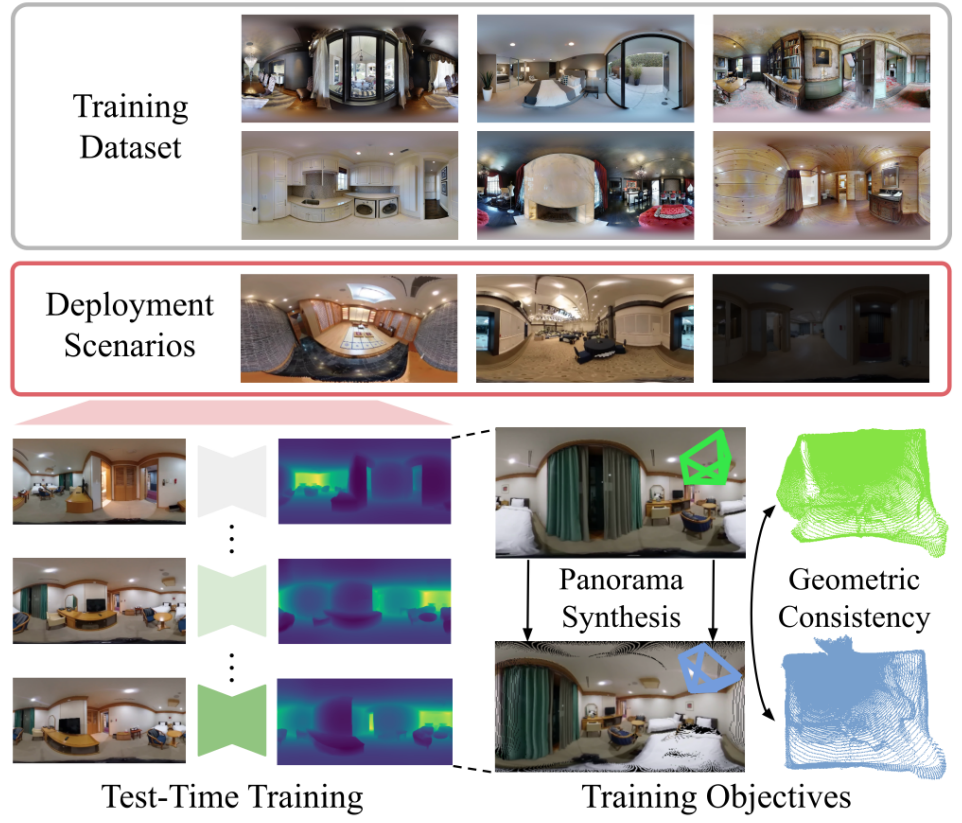
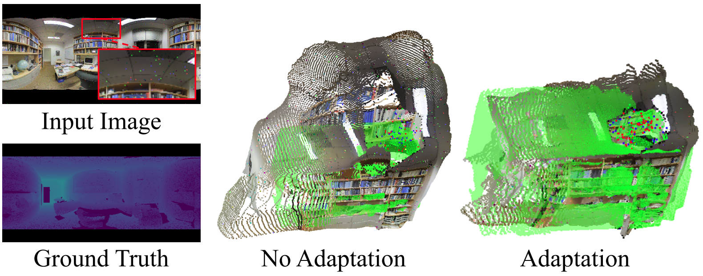

# Panoramic Depth Calibration
Official PyTorch implementation of **Calibrating Panoramic Depth Estimation for Practical Localization and Mapping (ICCV 2023)** [[Paper]](https://openaccess.thecvf.com/content/ICCV2023/html/Kim_Calibrating_Panoramic_Depth_Estimation_for_Practical_Localization_and_Mapping_ICCV_2023_paper.html) [[Video]](https://www.youtube.com/watch?v=KXz8IwrtJWg).

[](calib_overview.png)

Our method *calibrates* a pre-trained panoramic depth estimation network to new, unseen domains using test-time adaptation.
The resulting network can be used for downstream tasks such as visual navigation or map-free localization.
Below we show a qualitative sample, where our adaptation scheme leads to largely improved depth predictions amidst salt-and-pepper noise.

[](adaptation_sample.png)

In this repository, we provide the implementation and instructions for running our calibration method. If you have any questions regarding the implementation, please leave an issue or contact 82magnolia@snu.ac.kr.

## Installation
### GPUs supporting CUDA < 11.3
First setup a conda environment.
```
conda create -n pytorch3d python=3.9
conda activate pytorch3d
```
Then, follow the instructions from [PyTorch3D](https://github.com/facebookresearch/pytorch3d/blob/main/INSTALL.md#installing-prebuilt-binaries-for-pytorch3d) to install the library. Here, please use the following to install PyTorch3D after all the other dependencies are installed.
```
conda install pytorch3d -c pytorch3d
```
Then, install other dependencies with `pip install -r requirements.txt`.

### GPUs supporting CUDA >= 11.3
For GPUs supporting CUDA versions greater than `11.3` (e.g., RTX3090), installation is much more straightforward. Run the following sequence of commands.
```
conda create -n pytorch3d python=3.9
conda activate pytorch3d
conda install -c pytorch pytorch=1.11.0 torchvision cudatoolkit=11.3
conda install -c fvcore -c iopath -c conda-forge fvcore iopath
pip install --no-index --no-cache-dir pytorch3d -f https://dl.fbaipublicfiles.com/pytorch3d/packaging/wheels/py38_cu113_pyt1110/download.html
pip install -r requirements.txt
```

## Dataset Preparation (Stanford 2D-3D-S & OmniScenes)
First ownload the panorama images (`pano`) and poses (`pose`) from the following [link](https://docs.google.com/forms/d/e/1FAIpQLScFR0U8WEUtb7tgjOhhnl31OrkEs73-Y8bQwPeXgebqVKNMpQ/viewform?c=0&w=1) (download the one without `XYZ`) and the point cloud (`pcd_not_aligned`) from the following [link](https://docs.google.com/forms/d/e/1FAIpQLScDimvNMCGhy_rmBA2gHfDu3naktRm6A8BPwAWWDv-Uhm6Shw/viewform?c=0&w=1).
Also, download the 3D line segments through the following [link](https://drive.google.com/file/d/1Ur67nN8Q2n_CXQxbI341TRUbQEmtEjuD/view?usp=sharing).
Then, place the data in the directory structure below.

    panoramic-depth-calibration/data
    └── stanford (Stanford2D-3D-S Dataset)
        ├── pano (panorama images)
        │   ├── area_1
        │   │  └── *.png
        │   ⋮
        │   │
        │   └── area_6
        │       └── *.png
        ├── pcd (point cloud data)
        │   ├── area_1
        │   │   └── *.txt
        │   ⋮
        │   │
        │   └── area_6
        │       └── *.txt
        └── pose (json files containing ground truth camera pose)
            ├── area_1
            │   └── *.json
            ⋮
            │
            └── area_6
                └── *.json

To obtain results in OmniScenes, please refer to the download instructions [below](https://github.com/82magnolia/piccolo#downloading-omniscenes-update-new-scenes-added).
Note we are using the **old** version of OmniScenes for this repository.
In addition, download the 3D line segments through the following [link](https://drive.google.com/file/d/1M7A5iDXQdrPVUNmhKWRSFMQKit07jOK8/view?usp=sharing).
Then, place the data in the directory structure below.

    panoramic-depth-calibration/data
    └── omniscenes (OmniScenes Dataset)
        ├── change_handheld_pano (panorama images)
        │   ├── handheld_pyebaekRoom_1_scene_2 (scene folder)
        │   │  └── *.jpg
        │   ⋮
        │   │
        │   └── handheld_weddingHall_1_scene_2 (scene folder)
        │       └── *.jpg
        └── change_handheld_pose (json files containing ground truth camera pose)
        |   ├── handheld_pyebaekRoom_1_scene_2 (scene folder)
        |   │   └── *.json
        |   ⋮
        |   │
        |   └── handheld_pyebaekRoom_1_scene_2 (scene folder)
        |       └── *.json
        ⋮
        └── pcd (point cloud data)
            ├── pyebaekRoom_1.txt
            │
            ⋮
            │
            └── weddingHall_1.txt

## Running
Run the following command for Stanford 2D-3D-S.
```
mkdir log
python main.py --config config/stanford.ini --log log/LOG_FOLDER
```

Similarly, run the following command for OmniScenes
```
mkdir log
python main.py --config config/omniscenes.ini --log log/LOG_FOLDER
```

## Citation
If you find this repository useful, please cite

```bibtex
@InProceedings{Kim_2023_ICCV,
    author    = {Kim, Junho and Lee, Eun Sun and Kim, Young Min},
    title     = {Calibrating Panoramic Depth Estimation for Practical Localization and Mapping},
    booktitle = {Proceedings of the IEEE/CVF International Conference on Computer Vision (ICCV)},
    month     = {October},
    year      = {2023},
    pages     = {8830-8840}
}```


